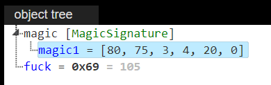
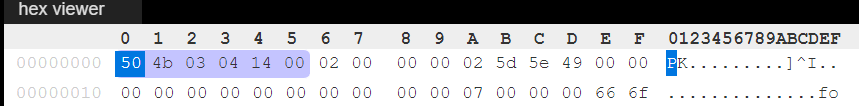

# a version of Kaitai Struct WebIDE

Online editor / visualizer for Kaitai Struct .ksy files

## Hack for better reverse engineering of file formats

Normally when you get an error while parsing a file with your .ksy, you can't really see how exactly it failed - you get some error message in the error window and the object tree window shows the last successful parsing. This version has a hack that lets you actually see the best attempt at parsing your file till the place where the parsing is no longer possible. This includes EOF and discrepancies between the content of file and "magic constants" defined in the .ksy file.

**When the parsing failed you will see no error message, but there will be an f-word key in the object tree.**


The way it works is that in the debug version of js parser the body of the read function of the root class gets enveloped with try-catch construction, which prevents getting error.

This is obviously a hack - the IDE should not be parsing the code of the js-parser. So I don't propose the change to the source repository.
### Notes on usage
#### Repeat

Due to the way repeats are implemented, if parsing fails, in the object tree you will only get the successfully parsed repeated substructures, and there will be no failed one. And if the substructure is not simple, finding the source of the error will be hard. In such cases I recommend to change the number of repeats to the number of successfully parsed substructures, and then add another one with no repeat key.

```yaml
- id: kek
  type: kek
  repeat: expr
  repeat-expr: 15
```
Only got 10 in the parsing tree.
```yaml
- id: kek
  type: kek
  repeat: expr
  repeat-expr: 10
- id: kek1
  type: kek
```

the rest is from the original file

## features

[See the Features wiki page](https://github.com/kaitai-io/kaitai_struct_webide/wiki/Features)

## community

[Visit us on Gitter](https://gitter.im/kaitai_struct/Lobby)

## demo

[ide.kaitai.io](https://ide.kaitai.io/)

## run locally (without compiling / modifying the source code)

- Clone deploy version: `git clone https://github.com/kaitai-io/ide-kaitai-io.github.io`
    - stable release: `/`, devel release: `/devel/`,
- Serve on a webserver (e.g. `python3 -m http.server 8000`)
- Go to [http://localhost:8000/](http://localhost:8000/)

## compile and run locally

- `git clone --recursive https://github.com/kaitai-io/kaitai_struct_webide`
- `npm install`
- `node serve.js --compile`
- Go to [http://127.0.0.1:8000/](http://127.0.0.1:8000/)

## screenshots


For more screenshots [visit the Features wiki page](https://github.com/kaitai-io/kaitai_struct_webide/wiki/Features)
